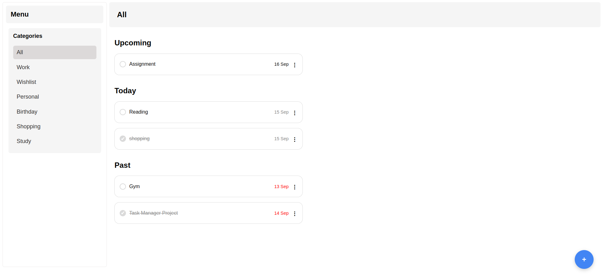
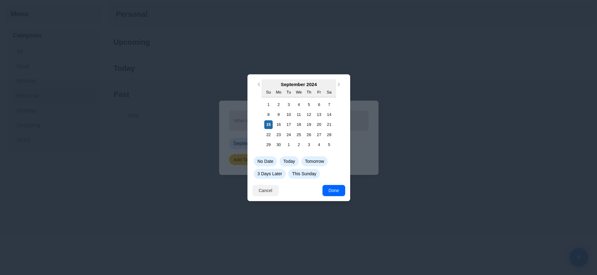
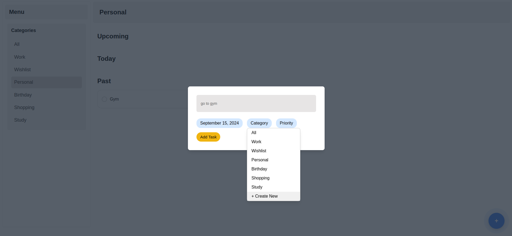

# Task Manager

Welcome to TaskManager! This is a handy app built with React, Node.js, and Mongodb to help you keep track of your tasks. Whether it's something you need to do today, something coming up, or something you missed, Task Manager has got you covered.

## Features

- **Organize Your Tasks**: Tasks are sorted into "Today", "Upcoming", and "Past" sections.
- **Filter Tasks**: Easily filter tasks by categories.
- **Add New Tasks**: Quickly add new tasks with our simple task creation modal.
- **Update Tasks**: Edit existing tasks with ease.
- **Delete Tasks**: Remove tasks that are no longer needed.

## Screenshots









## Getting Started

Follow these steps to get the project up and running on your local machine.

### Prerequisites

Make sure you have the following installed:

- [Node.js](https://nodejs.org/) (which includes npm)
- [Git](https://git-scm.com/)

### Installation

1. **Clone the Repository**:
    ```sh
    git clone https://github.com/navneetyadavv/Task-Manager.git
    ```

2. **Navigate to the Client Directory**:
    ```sh
    cd task-manager/client
    ```

3. **Install Client Dependencies**:
    ```sh
    npm install
    ```
    
4. **Clone the Repository**:
- Open the .env file in the client directory using your preferred text editor.
- Update the value of VITE_SERVER_DOMAIN to point to the local server:

  ```jsx
    VITE_SERVER_DOMAIN=http://localhost:3000
    ```

5. **Navigate to the Server Directory**:
    ```sh
    cd ../server
    ```

6. **Install Server Dependencies**:
    ```sh
    npm install
    ```

7. **Start the Server**:
    ```sh
    npm run start
    ```
